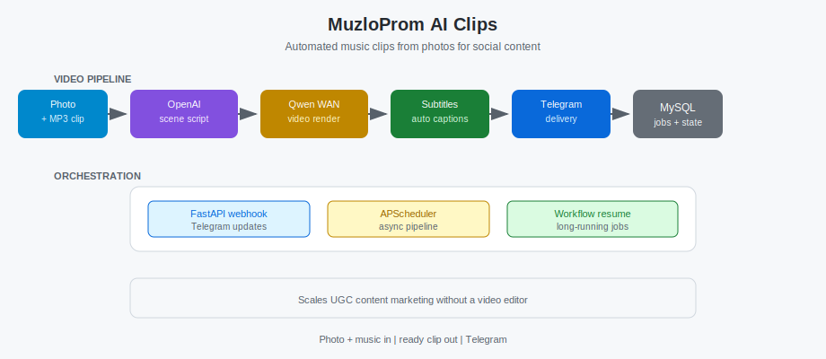

🇷🇺 [Русский](README.md) · 🇬🇧 [English](README.en.md) · 🇪🇸 [Español](README.es.md)

# MuzloProm AI Clips

**Clips musicales con IA desde fotos**

> Showcase sin código. Fuentes en repositorio privado.

---

## Problema

Clips musicales con IA desde fotos.

## Funcionalidad

Foto + MP3 → escena OpenAI → video Qwen WAN → subtítulos → Telegram.

## Valor de negocio

Escala marketing de contenido sin editor; UGC rápido para redes sociales.

## Stack

FastAPI · aiogram · MySQL · OpenAI · Qwen WAN · ffmpeg

## Arquitectura



## Ejecución

```bash
uvicorn app.main:app --host 0.0.0.0 --port 8100
```

**Estado:** ✅ En producción

**Case Study:** [05-muzloprom-ai-clips.md](https://github.com/alexanderomobile/portfolio/blob/main/case-studies/es/05-muzloprom-ai-clips.md)

[@alexanderomobile](https://github.com/alexanderomobile)
